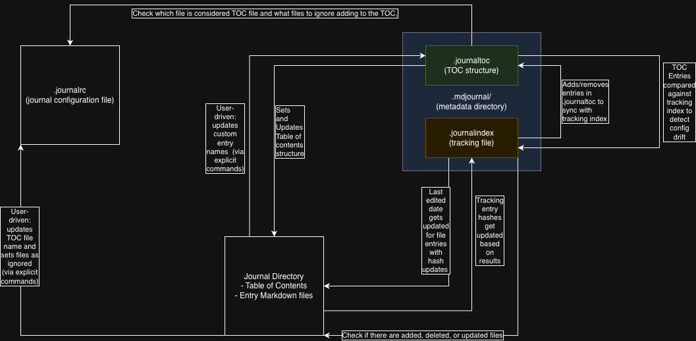

[Back to README](../README.md)

# Architecture Documentation

This document provides detailed technical information about the Markdown Journal CLI architecture, design decisions, and implementation details.

## 🏗️ System Architecture

### High-Level Overview
```
┌─────────────────┐    ┌─────────────────┐    ┌─────────────────┐
│   CLI Interface │    │   Command Layer │    │ Infrastructure  │
│  (Spectre.CLI)  │───▶│   (Commands/)   │───▶│   (Services)    │
└─────────────────┘    └─────────────────┘    └─────────────────┘
                                               │
                    ┌─────────────────────────────────────────┐
                    │  Core Services Layer                    │
                    │  • IJournalConfiguration               │
                    │  • IJournalConfigGenerator            │
                    │  • IJournalTocStructureRepository     │
                    │  • IJournalValidator                  │
                    │  • ITableOfContentsGenerator          │
                    │  • ITableOfContentsService            │
                    │  • ITableOfContentsMarkdownParser     │
                    │  • IFileTracking / IHashService       │
                    │  • IEntryFormatterService             │
                    │  • IAddTocService                     │
                    │  • IFileSystem                        │
                    │  • IInMemoryFileBuffer                │
                    │  • IMarkdownLinkRewriter              │
                    │  • ITemplateManager                   │
                    │  • IDryRunRenderer                    │
                    │  • IFileTransactionCoordinator        │
                    │  • IFileTransactionScope              │
                    │  • IRollbackReporter                  │
                    │  • IDeletionRollbackStrategy          │
                    └─────────────────────────────────────────┘
```

### Dependency Flow
```
Program.cs
    ├── TypeRegistrar (DI Setup)
    ├── CommandApp (Spectre.Console.Cli)
    └── Commands/
            ├── NewCommand
            ├── InitCommand
            └── [Future Commands]
                    └── Infrastructure/
                                    ├── IFileSystem (File operations)
                                    ├── IJournalInitializer (Journal creation)
                                    ├── IInitJournalService (Journal adoption)
                                    ├── ITemplateManager (Template generation)
                                    ├── IJournalConfiguration (Configuration management)
                                    └── Custom Exceptions
```

### File Infrastructure

Three metadata artifacts (`.journalrc`, `.mdjournal/.journalindex`, and `.mdjournal/.journaltoc`) are kept in sync with the journal directory's markdown files via a continuous loop when `mdjournal update journal` runs:



| Component | Role |
|---|---|
| `.journalrc` | Config file. Defines the TOC file name, file extensions, and the `ignoreFiles` list.|
| `.mdjournal/` | Hidden metadata directory. Contains `.journalindex` and `.journaltoc`. |
| `.mdjournal/.journalindex` | Tracking file. Stores SHA256 hashes and last-checked timestamps for every tracked `.md` file. |
| `.mdjournal/.journaltoc` | TOC structure file. Stores the topic hierarchy and root entries as JSON. |
| Journal Directory | The actual markdown entry files and generated Table of Contents on disk |

**Sync loop (automatic on `update journal`):**

1. **Disk → `.mdjournal/.journalindex`** — `FileTracking.DetectChangesWithoutUpdate()` walks the directory and compares file hashes against the stored index to identify added, modified, and deleted files.
2. **`.mdjournal/.journalindex` → Journal Directory** — Last-edited metadata is stamped into modified entry files; `.mdjournal/.journalindex` is updated with the new hashes.
3. **`.mdjournal/.journalindex` → `.mdjournal/.journaltoc`** — `JournalConfiguration.DetectConfigChanges()` diffs the tracking index keys against the combined entry set from `.mdjournal/.journaltoc` (root entries + topic hierarchy) and `.journalrc` (`ignoreFiles`) to find files that need to be added or removed. Structural adds and removes are written to `.mdjournal/.journaltoc` via `IJournalTocStructureRepository`. Config detection runs twice in the live path: once before the early-return check, and again after tracking is committed so that same-run file additions and deletions are captured.
4. **`.journalrc` + `.mdjournal/.journaltoc` → Journal Directory** — `TableOfContentsService` reads user settings from `.journalrc` and the topic structure from `.mdjournal/.journaltoc`, then regenerates the Table of Contents markdown file.

**User-driven (explicit commands only):**

- **Journal Directory → `.journalrc`** — Ignore-file flags (`update entry --ignore`) are written to `.journalrc`'s `ignoreFiles` list via explicit commands.
- **Journal Directory → `.mdjournal/.journaltoc`** — Entry heading/location changes (`update entry --headings`), display name changes (`update entry --name`/`--title`), and file renames are written to `.mdjournal/.journaltoc` via `IJournalTocStructureRepository`.

## 🔧 Dependency Injection Deep Dive

### The TypeRegistrar Pattern

**Problem Solved:**
Spectre.Console.Cli uses its own DI abstractions (`ITypeRegistrar`/`ITypeResolver`) to remain framework-agnostic, but we want to use Microsoft's powerful DI container.

**Solution:**
The `TypeRegistrar` acts as an adapter/bridge pattern implementation:

```csharp
// Spectre.Console.Cli Interface
public interface ITypeRegistrar
{
    void Register(Type service, Type implementation);
    ITypeResolver Build();
}

// Our Implementation (located in markdown_journal_cli.Infrastructure.DependencyInjection)
public sealed class TypeRegistrar : ITypeRegistrar
{
    private readonly IServiceCollection _services; // Microsoft DI
    
    public void Register(Type service, Type implementation)
    {
        _services.AddSingleton(service, implementation); // Translation
    }
}
```

**Translation Layer:**
| Spectre.Console.Cli | Microsoft.Extensions.DI |
|-------------------|-------------------------|
| `ITypeRegistrar` | `IServiceCollection` |
| `ITypeResolver` | `IServiceProvider` |
| `Register()` | `AddSingleton()` |
| `Resolve()` | `GetService()` |

### Registration Flow
1. **Startup** - `Program.cs` creates `TypeRegistrar`
2. **Registration** - Core services registered:
   - `IFileSystem` → `FileSystem` (File operations)
   - `IInMemoryFileBuffer` → `InMemoryFileBuffer` (Dry-run staging)
   - `IDeletionRollbackStrategy` → `InMemoryDeletionRollbackStrategy` (delete restoration snapshots)
   - `IFileTransactionCoordinator` → `FileTransactionCoordinator` (ambient rollback transactions)
   - `IRollbackReporter` → `RollbackReporter` (rollback UX reporting)
   - `ITemplateManager` → `TemplateManager` (Template processing)
   - `IJournalConfiguration` → `JournalConfiguration` (Config management)
   - `IJournalTocStructureRepository` → `JournalTocStructureRepository` (`.journaltoc` read/write)
   - `IJournalValidator` → `JournalValidator` (metadata directory layout validation)
   - `ITableOfContentsService` → `TableOfContentsService` (TOC generation + preview)
   - `ITableOfContentsGenerator` → `TableOfContentsGenerator` (TOC generation)
   - `IFileTracking` → `FileTracking` (Change detection)
   - `IHashService` → `HashService` (SHA256 hashing)
   - `IEntryFormatterService` → `EntryFormatterService` (Entry name formatting)
   - `IJournalFileUpdateService` → `JournalFileUpdateService` (Entry rename/move/ignore)
   - `IJournalUpdateService` → `JournalUpdateService` (Journal sync + dry-run report)
   - `IMarkdownLinkRewriter` → `MarkdownLinkRewriter` (Inline link rewriting)
   - `IDryRunRenderer` → `DryRunRenderer` (Dry-run terminal output)
   - `IAddTocService` → `AddTocService` (Dual-artifact TOC creation)
3. **Building** - `registrar.Build()` creates `IServiceProvider`
4. **Resolution** - Commands receive dependencies via constructor injection

### DI Registration (Program.cs)
```csharp
// Core services
host.Services.AddSingleton<IFileSystem, FileSystem>();
host.Services.AddSingleton<IInMemoryFileBuffer, InMemoryFileBuffer>();  // ← dry-run staging

// Rollback infrastructure
host.Services.AddSingleton<IDeletionRollbackStrategy, InMemoryDeletionRollbackStrategy>();
host.Services.AddSingleton<IFileTransactionCoordinator, FileTransactionCoordinator>();
host.Services.AddSingleton<IRollbackReporter, RollbackReporter>();

// Metadata directory infrastructure
host.Services.AddSingleton<IJournalTocStructureRepository, JournalTocStructureRepository>();
host.Services.AddSingleton<IJournalValidator, JournalValidator>();

host.Services.AddSingleton<ITemplateManager, TemplateManager>();
host.Services.AddSingleton<IJournalConfiguration, JournalConfiguration>();
host.Services.AddSingleton<INewJournalService, NewJournalService>();
host.Services.AddSingleton<IInitJournalService, InitJournalService>();  // ← init command
host.Services.AddSingleton<IEntryFormatterService, EntryFormatterService>();
host.Services.AddSingleton<IHashService, HashService>();
host.Services.AddSingleton<IFileTracking, FileTracking>();
host.Services.AddSingleton<ITableOfContentsService, TableOfContentsService>();
host.Services.AddSingleton<ITableOfContentsGenerator, TableOfContentsGenerator>();
host.Services.AddSingleton<ITableOfContentsMarkdownParser, TableOfContentsMarkdownParser>();
host.Services.AddSingleton<IJournalConfigGenerator, JournalConfigGenerator>();
host.Services.AddSingleton<IJournalUpdateService, JournalUpdateService>();
host.Services.AddSingleton<IMarkdownLinkRewriter, MarkdownLinkRewriter>();
host.Services.AddSingleton<IRemoveEntryService, RemoveEntryService>();  // ← remove command
host.Services.AddSingleton<IDryRunRenderer, DryRunRenderer>();          // ← dry-run rendering
host.Services.AddSingleton<IAddTocService, AddTocService>();            // ← add toc command

// Commands
host.Services.AddSingleton<NewCommand>();
host.Services.AddSingleton<InitCommand>();   // ← init command
host.Services.AddSingleton<AddEntry>();
host.Services.AddSingleton<AddJournalrc>();
host.Services.AddSingleton<AddTableOfContents>();
host.Services.AddSingleton<AddFileTracking>();
host.Services.AddSingleton<UpdateCommand>();
host.Services.AddSingleton<UpdateEntryCommand>();
host.Services.AddSingleton<RemoveEntryCommand>();  // ← remove command
```

### Benefits of This Approach
- ✅ **Testability** - Easy to mock `IFileSystem` in tests
- ✅ **Flexibility** - Can swap implementations without changing commands
- ✅ **Separation of Concerns** - Commands focus on business logic
- ✅ **Future-Proof** - Easy to add new services (logging, config, etc.)

## 🚨 Exception Architecture

### Exception Hierarchy
```
System.Exception
    └── JournalException (Base for all journal errors)
            ├── JournalAlreadyExistsException
            ├── JournalrcNotFoundException
            ├── TrackingIndexNotFoundException
            ├── TocFileAlreadyExistsException      ← thrown when init target TOC filename already exists
            ├── TocRenameConflictException         ← thrown when --rename-toc target filename is already in use
            ├── ProtectedJournalFileException      ← thrown when remove entry targets .journalrc, tracking index, or TOC
            └── [other domain-specific exceptions]
```

### `JournalCommand<TSettings>` Base Class

All commands extend `JournalCommand<TSettings>` instead of `Command<TSettings>` directly. This base class seals the Spectre.Console `Execute()` entrypoint and maps `RollbackCompletedException` to the standard exit codes:

```csharp
public abstract class JournalCommand<TSettings> : Command<TSettings>
    where TSettings : CommandSettings
{
    public sealed override int Execute(CommandContext context, TSettings settings)
    {
        try { return ExecuteCore(context, settings); }
        catch (RollbackCompletedException ex)
        {
            return ex.Result.IsFullyRestored ? 2 : 3;
        }
    }

    protected abstract int ExecuteCore(CommandContext context, TSettings settings);
}
```

- Exit code `2` — operation failed mid-write, all changes fully rolled back (safe to retry)
- Exit code `3` — operation failed mid-write, rollback had errors (manual inspection recommended)

## 📁 File System Abstraction

### Interface Design
```csharp
public interface IFileSystem
{
    bool DirectoryExists(string path);
    void CreateDirectory(string path);
    string CombinePaths(params string[] paths);
    void RenameFile(string oldPath, string newPath);
    string? GetFileName(string? path);
    string GetFullPath(string path);   // ← returns the absolute path for a relative input
    // ...
    /// <summary>
    /// Returns the relative paths of all markdown (.md) files found recursively
    /// under <paramref name="directory"/>, relative to that directory.
    /// Added to support IMarkdownLinkRewriter scanning without coupling to System.IO.
    /// </summary>
    IReadOnlyList<string> GetMarkdownFiles(string directory);
}
```

### Implementation Strategies

**Production Implementation:**
```csharp
public class FileSystem : IFileSystem
{
    public bool DirectoryExists(string path) => Directory.Exists(path);
    public void CreateDirectory(string path) => Directory.CreateDirectory(path);
    public string CombinePaths(params string[] paths) => Path.Combine(paths);
}
```

**Test Implementation:**
```csharp
public class TestFileSystem : IFileSystem
{
    public List<string> CreatedDirectories { get; } = new();
    
    public void CreateDirectory(string path) => CreatedDirectories.Add(path);
    // Mock other methods...
}
```

### Why Abstract the File System?
- ✅ **Unit Testing** - No actual files created during tests
- ✅ **Cross-Platform** - Abstraction handles OS differences
- ✅ **Security** - Can add validation/sandboxing later
- ✅ **Monitoring** - Can add logging/metrics without changing commands

## 🏗️ Service Architecture

### Core Services Overview

The application follows a service-oriented architecture with clear separation of concerns:

**`IRemoveEntryService`** - Orchestrates full removal of a journal entry
```csharp
public interface IRemoveEntryService
{
    IReadOnlyList<string> RemoveEntry(string journalPath, string fileName, bool cleanRefs);
}
```
- Validates `.journalrc` and tracking index exist before proceeding
- Guards against protected infrastructure files (`.journalrc`, tracking index, TOC file)
- Deletes the entry file, removes it from config and tracking, regenerates the TOC
- When `cleanRefs` is `true`, calls `IMarkdownLinkRewriter.StripLinksInDirectory` to remove dead links across the journal and re-hashes modified files
- Returns relative paths of files modified by dead-link cleanup (empty when `cleanRefs` is `false`)

**`IInitJournalService`** - Orchestrates adoption of existing directories as journals
```csharp
public interface IInitJournalService
{
    void Initialize(string journalDirectory, string journalName, string? tableOfContentsName);
}
```
- Validates the directory exists and isn't already managed (done by `InitCommand` before calling)
- Creates tracking index, config, and TOC from existing files — no template files
- Accepts an optional custom TOC name; throws `TocFileAlreadyExistsException` on conflict
- Distinct from `IJournalInitializer` which creates a new directory with starter templates

**`IJournalInitializer`** - Orchestrates journal creation
```csharp
public interface IJournalInitializer
{
    void Initialize(string journalDirectory, string journalName);
}
```
- Coordinates file creation, templating, and configuration
- Encapsulates journal initialization business logic
- Makes NewCommand focus solely on CLI concerns

**`ITemplateManager`** - Handles template processing
```csharp
public interface ITemplateManager
{
    string GenerateFromTemplate(string templateName, Dictionary<string, object>? parameters);
    void RegisterTemplate(ITemplateGenerator template);
}
```
- Generates content from templates (table of contents, journal entries)
- Extensible template system for custom journal formats
- Parameters support for dynamic content generation

**`IJournalConfiguration`** - Manages journal configuration files
```csharp
public interface IJournalConfiguration
{
    void Create(string directory, JournalConfig config);
    JournalConfig? Read(string directory);
    void Update(string directory, Action<JournalConfig> config);
    void AddEntry(string directory, string name, string file, ...);
    bool RemoveEntry(string directory, string file);
    bool UpdateEntryName(string directory, string file, string newEntryName);
    void UpdateFileReferences(string directory, string oldFile, string newFile);
    (Entries? entry, string[] topicPath) FindEntry(string directory, string fileName);
}
```
- Handles all `.journalrc` CRUD operations
- Supports complex nested topic/subtopic hierarchy
- Provides entry find, rename, and file-reference update for rename workflows

**`IJournalFileUpdateService`** - Orchestrates entry update operations```csharp
public interface IJournalFileUpdateService
{
    void UpdateEntry(string directory, string currentFileName, ..., bool updateBacklinks = true);
    void RenameEntry(string directory, string oldFile, string newFile);
    void UpdateEntryLocation(string directory, string fileName, string[] newTopicPath, string displayName);
    void UpdateEntryDisplayName(string directory, string fileName, string newDisplayName);
    void SetIgnoreStatus(string directory, string fileName, bool ignored);
}
```
- Orchestrates renaming, relocation, title changes, and ignore-status toggling
- Updates all references: file system, tracking index, config, TOC, and backlinks in a single operation
- `updateBacklinks` (default `true`): when a rename occurs, rewrites inline link references in all other entry files via `IMarkdownLinkRewriter`; suppressed with `--no-backlinks` flag

**`IMarkdownLinkRewriter`** - Reusable inline-link rewriting infrastructure
```csharp
public interface IMarkdownLinkRewriter
{
    string RewriteLinks(string content, string oldFileName, string newFileName);
    IReadOnlyList<string> FindFilesWithLinkTo(string directory, string fileName);
    IReadOnlyList<string> ReplaceLinksInDirectory(
        string directory, string oldFileName, string newFileName,
        IReadOnlyCollection<string>? excludeFiles = null);
    IReadOnlyList<string> StripLinksInDirectory(
        string directory, string fileName,
        IReadOnlyCollection<string>? excludeFiles = null);
}
```
- Stateless, reusable — designed to serve any future file-rename or file-removal operation
- `RewriteLinks` is a pure string transformation (regex, no I/O)
- `ReplaceLinksInDirectory` is the preferred bulk API for renames: scans, rewrites, and persists all changed files in one call, returning the list of modified relative paths
- `StripLinksInDirectory` is the bulk API for removals: scans all `.md` files, replaces `[text](removed.md)` with just `text`, and persists changed files — used by `RemoveEntryService` when `--clean-refs` is passed
- Matches only inline links `[text](path/file.md)`; reference-style links are out of scope for this iteration
- Uses `RegexOptions.Compiled` — the pattern is JIT-compiled once and reused across every `.md` file in the journal

**`IJournalUpdateService`** - Orchestrates `update journal` operations
```csharp
public interface IJournalUpdateService
{
    void UpdateJournalConfig(string journalPath, JournalConfigSyncResult syncResult);
    void UpdateTableOfContents(string journalPath);
    void RenameToc(string journalPath, string newBaseName);
    UpdateDryRunReport BuildDryRunReport(
        string journalPath,
        ChangeDetectionResult? trackingChanges,
        JournalConfigSyncResult? configChanges,
        bool includeToc,
        string? renameTocTarget);
}
```
- `BuildDryRunReport` is a pure read path: projects pending tracking/config drift into an in-memory `UpdateDryRunReport` without any disk writes
- When both tracking and config are in scope, config drift is re-computed against the projected tracking state so TOC preview reflects pending changes
- Each section of the report is `null` when its corresponding flag was not requested (scoped by the same flags as the live path)

**`ITableOfContentsService`** - TOC generation with preview support
```csharp
public interface ITableOfContentsService
{
    void UpdateTableOfContents(string journalDirectory, ...);
    string PreviewTableOfContents(string journalDirectory);
    string PreviewTableOfContents(string journalDirectory, JournalConfig projectedConfig);
}
```
- `PreviewTableOfContents()` generates the TOC markdown and returns it as a string without writing to disk
- The overload accepting a `projectedConfig` bypasses disk-based `.journalrc` reading — used by the dry-run path to preview the TOC after in-memory config drift is applied
- Both preview overloads preserve existing `Created`/`Last Edited` dates from the current TOC file on disk

**`IInMemoryFileBuffer`** - In-memory file staging and snapshot service
```csharp
public interface IInMemoryFileBuffer
{
    void Snapshot(string absolutePath);        // capture current disk content for rollback
    void Stage(string absolutePath, string content); // store generated content without disk I/O
    string? GetStaged(string absolutePath);
    string? GetSnapshot(string absolutePath);
    void Commit(string absolutePath);          // write staged content to disk
    void Restore(string absolutePath);         // restore from snapshot (rollback)
    bool HasStaged(string absolutePath);
    bool HasSnapshot(string absolutePath);
    void Clear();
}
```
- Registered as singleton in DI; case-insensitive path keys
- Used by the dry-run path to stage and read generated TOC content without touching disk
- Designed to be wired into `JournalUpdateService` write operations in the future for transactional rollback on partial failure (infrastructure is in place; write-path integration is future work)

**`IFileTransactionCoordinator`** — Singleton factory for per-operation file transaction scopes.
- `Begin()` creates a new root `IFileTransactionScope` and sets it as the thread-local ambient scope. Throws if a scope is already active.
- `BeginOrJoin()` returns a `JoinedTransactionScope` wrapping the current ambient scope if one exists, or calls `Begin()` if not. Use in services that may be called from within an outer command-level transaction.
- `Current` — the currently active ambient scope, or `null` if none.

**`IFileTransactionScope`** — Represents an active file transaction. Tracks write operations so they can be reversed on failure. Auto-rolls back on `Dispose()` if `Commit()` was not called.
- `Track(path)` — snapshot an existing file *before* modifying it (first-write-wins; subsequent calls for the same path are no-ops)
- `TrackNew(path)` — record a file that will be created; rollback deletes it
- `TrackRename(oldPath, newPath)` — record a rename; rollback renames back
- `TrackDelete(path)` — snapshot file content *before* deletion; rollback re-creates it
- `TrackNewDirectory(path)` — record a directory that will be created; rollback deletes it
- `Commit()` — clears all tracked entries and marks the transaction complete; `Dispose()` is a no-op afterwards
- `Rollback()` → `RollbackResult` — reverses all tracked changes in reverse registration order; idempotent

**`JoinedTransactionScope`** — Returned by `BeginOrJoin()` when a root scope is already active. Delegates all `Track*` and `Rollback()` calls to the root. `Commit()` on a joined scope is a local no-op — only `Commit()` on the root scope finalizes the transaction. Useful for services that want to participate in a caller-initiated transaction without owning its lifetime.

**`IDeletionRollbackStrategy`** — Captures and restores file content for `TrackDelete` entries. `InMemoryDeletionRollbackStrategy` stores content in a dictionary keyed by absolute path.

**`IRollbackReporter`** — Writes rollback progress and results to the terminal.
- `ReportRollbackStarting(description, cause)` — red error line + yellow "Rolling back changes..." notice
- `ReportRollbackComplete(result, journalRoot)` — Spectre.Console rounded table listing each restored/failed file; green "fully rolled back" or red partial-rollback warning

**`NoOpFileTransactionCoordinator` / `NoOpFileTransactionScope` / `NoOpRollbackReporter`** — Silent no-op implementations in `NoOpTransactionInfrastructure.cs`. Use the static `Instance` singleton in tests and dry-run contexts.

**`IDryRunRenderer`** - Renders an `UpdateDryRunReport` to the terminal
```csharp
public interface IDryRunRenderer
{
    void Render(UpdateDryRunReport report, string journalPath);
}
```
- All output is read-only — no file writes occur here
- Renders color-coded Spectre.Console tables per section: tracking changes (added/modified/deleted), config changes (will be added/removed), TOC diff (LCS line-level diff panel), and rename-toc preview with backlink file list
- Each section is rendered only when the corresponding report property is non-null and has changes
- `TextDiffer` (internal `static` class) provides the LCS-based line diff consumed by the TOC section

**Dry-Run Data Models** — `Infrastructure/Tracking/Models/UpdateDryRunReport.cs`
- `UpdateDryRunReport` — top-level aggregate; each section is `null` when not requested
- `TocDiffResult` — holds `CurrentContent` and `PreviewContent` for line-level diffing at render time; `HasChanges` is a string equality check
- `TocRenameDryRunResult` — describes a pending `--rename-toc` without applying it; carries `CurrentName`, `NewName`, and the list of files with backlinks to update

### Service Interaction Flow
```
NewCommand
    └── IJournalInitializer.Initialize()
            ├── IFileSystem.CreateDirectory()
            ├── ITemplateManager.GenerateFromTemplate() (4x)
            ├── IJournalConfiguration.Create()
            ├── ITableOfContentsGenerator.UpdateTableOfContents()
            └── IFileTracking.UpdateIndex()

InitCommand
    └── IInitJournalService.Initialize()
            ├── IFileSystem.FileExists()              (TOC conflict check)
            ├── IFileTracking.LoadIndex()             (load or create index)
            ├── IFileTracking.UpdateIndex()           (index all existing .md files)
            ├── IJournalConfigGenerator.GenerateFromTrackingIndex()  (write .journalrc)
            ├── ITableOfContentsService.UpdateTableOfContents()      (create TOC)
            └── IFileTracking.UpdateIndex()           (re-index to include newly created TOC)
            ✗ Does NOT create template files (unlike NewCommand)

AddEntry
    ├── IEntryFormatterService.FormatEntryName()
    ├── IFileSystem.CreateMarkdownFile()
    ├── ITemplateManager.GenerateFromTemplate()
    ├── IJournalConfiguration.AddEntry()
    ├── IFileTracking.UpdateFileInIndex()
    └── ITableOfContentsGenerator.UpdateTableOfContents()

UpdateJournal
    ├── [--dry-run path] → ExecuteDryRun()
    │       ├── IFileTracking.DetectChangesWithoutUpdate()  (when tracking in scope)
    │       ├── IJournalConfiguration.DetectConfigChanges()  (when config in scope)
    │       ├── IJournalUpdateService.BuildDryRunReport()
    │       │       ├── ComputeProjectedConfigDrift()        (projects config drift from pending tracking)
    │       │       ├── ITableOfContentsService.PreviewTableOfContents()  (no disk write)
    │       │       └── IMarkdownLinkRewriter.FindFilesWithLinkTo()  (rename preview backlinks)
    │       └── IDryRunRenderer.Render()                    (zero writes; exit 0)
    ├── [live path] IFileTracking.DetectChangesWithoutUpdate()
    ├── MarkdownMetadataParser.UpdateLastEditedDate()
    ├── IJournalConfiguration.AddEntry() / RemoveEntry()
    └── ITableOfContentsGenerator.UpdateTableOfContents()

UpdateEntry
    └── IJournalFileUpdateService.UpdateEntry()
            ├── IFileSystem.RenameFile()             (when renaming)
            ├── IFileTracking.RenameFileInIndex()    (when renaming)
            ├── IJournalConfiguration.UpdateFileReferences() (when renaming)
            ├── IMarkdownLinkRewriter.ReplaceLinksInDirectory() (when renaming & updateBacklinks=true)
            │       └── IFileSystem.GetMarkdownFiles() (enumerate .md files, excludes TOC + renamed file)
            │       └── IFileSystem.UpdateFile()       (persist each changed file)
            ├── IJournalConfiguration.UpdateEntryLocation()  (when moving heading)
            ├── IJournalConfiguration.UpdateEntryName()      (when changing title)
            ├── IJournalConfiguration.AddIgnoreEntry() / RemoveEntry() (ignore toggle)
            └── ITableOfContentsGenerator.UpdateTableOfContents()

UpdateJournal --rename-toc
    └── IJournalUpdateService.RenameToc()
            ├── IJournalConfiguration.Read()           (get current TOC filename)
            ├── IFileSystem.FileExists()               (conflict check)
            ├── IFileSystem.RenameFile()               (rename on disk)
            ├── IJournalConfiguration.Update()         (update .journalrc)
            ├── IFileTracking.RenameFileInIndex()      (update tracking)
            ├── IMarkdownLinkRewriter.ReplaceLinksInDirectory()  (bulk rewrite)
            │       └── IFileSystem.GetMarkdownFiles() (enumerate .md files)
            │       └── IFileSystem.UpdateFile()       (persist each changed file)
            ├── MarkdownMetadataParser.UpdateLastEditedDate() (stamp modified files)
            └── IFileTracking.UpdateFileInIndex()      (per modified file)

AddJournalrc
    └── IJournalConfigGenerator.GenerateFromTableOfContents()
            └── ITableOfContentsMarkdownParser.ParseTableOfContents()
    └── IJournalConfigGenerator.GenerateFromTrackingIndex()
    └── IJournalConfigGenerator.GenerateFromDirectory()

AddTableOfContents
    └── IAddTocService.Execute(journalDir, structureOnly, mdOnly)
            ├── IJournalConfiguration.Read()                          (read config for TOC file path)
            ├── [when structureOnly=false] IFileSystem.FileExists()   (check markdown TOC existence)
            ├── [when mdOnly=false] IFileSystem.FileExists()          (check .journaltoc existence)
            ├── [creating .journaltoc] IJournalTocStructureRepository.Save(JournalTocStructure.Empty(), metadataDir)
            ├── [creating markdown TOC] ITableOfContentsService.UpdateTableOfContents()
            │       └── IFileTracking.UpdateFileInIndex()             (index newly created TOC)
            └── returns AddTocResult (Created | PartiallyCreated | AlreadyExists)

AddFileTracking
    └── IFileTracking.UpdateIndex()
```

### Configuration Generation Strategy

When creating a `.journalrc` for an existing journal, the system attempts three sources in order, stopping at the first successful result:

1. **Table of contents file** - Uses `ITableOfContentsMarkdownParser` to extract entries and build config.
2. **Tracking index** - Uses the `.md-journal` index to infer known files.
3. **Directory scan** - Falls back to scanning the journal directory for markdown files.

This approach prioritizes the most user-curated source first (TOC), then known tracking data, and only scans the directory as a last resort.

### Benefits of Service Architecture
- ✅ **Single Responsibility** - Each service has one clear purpose
- ✅ **Testability** - Services can be tested in isolation
- ✅ **Maintainability** - Changes to one service don't affect others
- ✅ **Extensibility** - Easy to add new services or modify existing ones
- ✅ **Reusability** - Services can be used by multiple commands

## � Key Architectural Patterns

### Natural Sorting Algorithm

Implemented in `JournalConfiguration.cs` via the `NaturalStringComparer` class:

**Problem:** Lexicographic string sorting places "file_10" before "file_5" because it compares character-by-character ('1' < '5').

**Solution:** Custom `IComparer<string>` that treats consecutive digits as complete numbers:

```csharp
internal class NaturalStringComparer : IComparer<string>
{
    public int Compare(string? x, string? y)
    {
        // Parse and compare numeric segments as integers
        // Example: "file_5" < "file_10" < "file_100"
    }
    
    private static long ExtractNumber(string str, ref int index)
    {
        // Extracts consecutive digits as a long integer
    }
}
```

**Benefits:**
- Natural ordering matches file system behavior
- Works with any numeric values (handles leading zeros)
- Case-insensitive alphabetic comparison
- Used for both topic names and entry filenames

**Example Output:**
- Input: `["file_10", "file_5", "file_100", "file_1"]`
- Sorted: `["file_1", "file_5", "file_10", "file_100"]`

### Parent-Child Topic Detection

Implemented in `TableOfContentsGenerator.cs` for smart TOC rendering:

**Problem:** When a topic has an entry with matching name AND subtopics, should we render both or merge them?

**Solution:** Three-part detection algorithm:

1. **Name Matching**: Check if topic name equals entry name (case-insensitive)
2. **File Prefix Matching**: Verify all subtopic files start with entry file path
3. **Edge Case Handling**: Merge entry link into topic heading, render subtopics below

```csharp
// Edge case detection
if (visibleEntries.Length == 1 && 
    string.Equals(topic.Name, visibleEntries[0].Name, StringComparison.OrdinalIgnoreCase))
{
    // Render as: ## [Topic](topic.md)
    //            - Subtopic 1
    //            - Subtopic 2
}
```

**Example:**
```
Config:
  Topic: "abc"
  Entry: "abc.md"
  Subtopics: ["test 2"]

TOC Output:
  ## [Abc](abc.md)
    - Test 2
      - [test file 1](abc-test_2-test_file_1.md)
```

### Ignore Files Pattern

**Purpose:** Allow entries to exist in configuration but be excluded from TOC.

**Implementation:**
- `.journalrc` contains `ignoreFiles` array
- Files added with `--ignore-file` flag
- Filtered at TOC generation time
- Still tracked in file system and configuration

**Use Cases:**
- Draft entries not ready for publication
- Private notes
- Template files
- Work-in-progress documentation

**Example:**
```json
{
  "tableOfContents": {
    "ignoreFiles": ["draft.md", "private-notes.md"]
  }
}
```

### File Change Detection

**Architecture:**
```
IFileTracking
    └── IHashService (SHA256)
            └── .md-journal index file
```

**Process:**
1. **Index Creation**: Hash all markdown files on journal initialization
2. **Storage**: Save index to `.md-journal` JSON file
3. **Detection**: Compare current file hashes with stored hashes
4. **Results**: Return added/modified/deleted file lists

**Index Structure:**
```json
{
  "files": {
    "intro.md": "a3f2b8c...",
    "topic-entry.md": "d4e9c1a..."
  }
}
```

**Benefits:**
- Detects external file modifications
- No need for file system watchers
- Works across sessions
- Cryptographically secure (SHA256)

### Metadata Update Pattern

**Purpose:** Automatically maintain "Last Edited:" dates in markdown files when content changes.

**Implementation:**
- Located in `MarkdownMetadataParser.UpdateLastEditedDate()`
- Searches metadata header (first 6 non-empty lines before heading)
- Replaces existing "Last Edited:" line or inserts after "Created:" line
- Preserves file structure and existing metadata

**Metadata Header Format:**
```markdown
Created: 01/15/2025
Last Edited: 02/11/2026

# Entry Title
Content here...
```

**Update Algorithm:**
1. Split content into lines
2. Search metadata header (stops at first heading with `#`)
3. If "Last Edited:" line exists, replace it
4. If not found, insert after "Created:" line (or at top if no "Created:" line)
5. Format date according to journal settings

**Benefits:**
- Automatic change tracking
- Preserves existing metadata
- Configurable date format
- Works with manual file edits (detected via hash changes)

### TOC File Exclusion Pattern

**Problem:** The table of contents file can accidentally be added to `.journalrc` as an entry, causing it to appear in its own contents (circular reference).

**Multi-Layer Solution:**

**1. Prevention at Entry Time (`AddEntry`):**
```csharp
public void AddEntry(string directory, string name, string file, ...)
{
    // Check if file is TOC file - skip it
    var config = Read(directory);
    if (config != null && string.Equals(file, config.TableOfContents.File, ...))
    {
        return; // Never add TOC file as entry
    }
    // ... rest of add logic
}
```

**2. Auto-Cleanup on TOC Change (`JournalConfiguration.Update`):**
```csharp
public void Update(string directory, Action<JournalConfig> config)
{
    var oldTocFile = existingConfig.TableOfContents?.File;
    config(existingConfig); // Apply user changes
    var newTocFile = existingConfig.TableOfContents?.File;
    
    // If TOC file changed, remove new TOC file from entries
    if (newTocFile != oldTocFile)
    {
        RemoveEntryFromConfig(existingConfig, newTocFile);
    }
}
```

**3. Skip During Update Command (`UpdateCommand`):**
```csharp
private void UpdateJournalConfig(string journalPath, ChangeDetectionResult fileResults)
{
    var tocFile = config?.TableOfContents.File;
    
    foreach (var relativePath in fileResults.AddedFiles)
    {
        // Skip TOC file when processing added files
        if (string.Equals(relativePath, tocFile, ...)) continue;
        
        _journalConfiguration.AddEntry(...);
    }
}
```

**4. Filter During TOC Generation (`TableOfContentsGenerator`):**
```csharp
public string GenerateTableOfContents(JournalConfig config)
{
    var tocFile = config.TableOfContents.File;
    var ignoreFiles = config.TableOfContents.IgnoreFiles ?? [];
    
    // Auto-append TOC file to ignore list during rendering
    var ignoreFilesWithToc = ignoreFiles.Append(tocFile).ToArray();
    
    // Filter entries using expanded ignore list
    // ...
}
```

**Benefits:**
- **Defense in Depth**: Multiple layers prevent the issue
- **Auto-Recovery**: If TOC file somehow becomes an entry, it's automatically removed
- **User-Proof**: Works even if user manually edits configuration
- **No Breaking Changes**: Works with existing journals

**Edge Cases Handled:**
- User changes TOC filename → Old entry removed, new file excluded
- Manual config edit adds TOC → Update() cleans it up
- External file sync adds TOC → UpdateCommand skips it
- Direct AddEntry call with TOC → Rejected at entry point

## �🧪 Testing Architecture

### Test Structure
```
markdown-journal-cli.Tests/
├── Commands/
│   ├── NewCommandTests.cs
│   ├── Init/
│   │   └── InitCommandTests.cs          ← init command integration tests
│   ├── Add/
│   │   ├── AddEntryCommandTests.cs
│   │   ├── AddJournalrcCommandTests.cs
│   │   ├── AddTableOfContentsCommandTests.cs
│   │   ├── AddTableOfContentsIntegrationTests.cs
│   │   ├── AddFileTrackingRollbackTests.cs   ← rollback: fault-inject each write step
│   │   ├── AddJournalrcRollbackTests.cs
│   │   └── AddTableOfContentsRollbackTests.cs
│   ├── Remove/
│   │   └── RemoveEntryCommandTests.cs   ← remove entry command tests
│   └── Update/
│       ├── UpdateCommandTests.cs        ← extended: --rename-toc and --dry-run dispatch tests added
│       └── UpdateEntryCommandTests.cs
├── Infrastructure/
│   ├── FileSystem/
│   │   ├── FileSystemTests.cs
│   │   ├── FaultInjectingFileSystem.cs       ← test helper: fault injection for IFileSystem
│   │   ├── InMemoryFileBufferTests.cs    ← Snapshot/Stage/Commit/Restore tests
│   │   ├── MarkdownLinkRewriterTests.cs  ← extended: StripLinksInDirectory tests added
│   │   ├── MarkdownMetadataParserTests.cs
│   │   └── TestFileSystem.cs
│   ├── Transactions/
│   │   ├── FileTransactionScopeTests.cs       ← Track*/Commit/Rollback + reverse-order tests
│   │   ├── FileTransactionCoordinatorTests.cs  ← Begin/BeginOrJoin ambient scope tests
│   │   ├── JoinedTransactionScopeTests.cs      ← joined scope delegation tests
│   │   ├── RollbackReporterTests.cs            ← console output tests
│   │   └── TransactionEdgeCaseTests.cs         ← idempotency, disposed scope, etc.
│   ├── Configuration/
│   │   └── JournalTocStructureRepositoryTests.cs  ← Load/Save round-trip; absent file returns Empty()
│   ├── Validation/
│   │   └── JournalValidatorTests.cs            ← valid layout; missing dir; missing .journalindex; missing .journaltoc
│   ├── FileTrackingTests.cs
│   ├── HashServiceTests.cs
│   ├── JournalConfigurationTests.cs
│   ├── JournalConfigGeneratorTests.cs
│   ├── TableOfContentsMarkdownParserTests.cs
│   └── TypeRegistrarTests.cs
├── JournalTemplates/
│   ├── JournalInitializerTests.cs
│   ├── TableOfContentsGeneratorTests.cs
│   └── TemplateManagerTests.cs
└── Services/
    ├── EntryFormatter/
    │   └── EntryFormatterServiceTests.cs
    ├── InitJournal/
    │   └── InitJournalServiceTests.cs
    ├── JournalEntry/
    │   └── JournalEntryServiceTests.cs
    ├── JournalFileUpdate/
    │   └── JournalFileUpdateServiceTests.cs
    ├── JournalUpdate/
    │   └── JournalUpdateServiceTests.cs      ← extended: RenameToc + BuildDryRunReport test cases added
    ├── NewJournal/
    │   └── NewJournalServiceTests.cs
    ├── AddToc/
    │   └── AddTocServiceTests.cs             ← dual-artifact creation; structureOnly; mdOnly; AlreadyExists
    ├── RemoveEntry/
    │   └── RemoveEntryServiceTests.cs        ← remove entry service tests
    ├── Rollback/
    │   ├── ServiceRollbackTestBase.cs               ← shared helpers for rollback tests
    │   ├── InitJournalServiceRollbackTests.cs
    │   ├── JournalEntryServiceRollbackTests.cs
    │   ├── JournalFileUpdateServiceRollbackTests.cs
    │   ├── JournalUpdateServiceRollbackTests.cs
    │   ├── NewJournalServiceRollbackTests.cs
    │   └── RemoveEntryServiceRollbackTests.cs
    └── TableOfContents/
        └── TableOfContentsServiceTests.cs    ← extended: PreviewTableOfContents tests added
```

### Testing Strategy

**Command Testing Pattern:**
```csharp
public class NewCommandTests
{
    private readonly TestConsole _console;
    private readonly TestFileSystem _fileSystem;
    private readonly CommandAppTester _app;

    public NewCommandTests()
    {
        _console = new TestConsole();
        _fileSystem = new TestFileSystem();
        
        // Set up test DI container
        var registrar = new Tests.Infrastructure.TypeRegistrar()
            .RegisterInstance(_console)
            .RegisterInstance<IFileSystem>(_fileSystem);

        _app = new CommandAppTester(registrar);
    }
}
```

**Test Categories:**
1. **Happy Path Tests** - Valid inputs produce expected outputs
2. **Error Handling Tests** - Invalid inputs produce proper error messages
3. **Integration Tests** - Full command execution with mocked dependencies
4. **Validation Tests** - Command argument validation
5. **Edge Case Tests** - Parent-child detection, natural sorting, ignore files
6. **Change Detection Tests** - File tracking with hash comparison
7. **Format Tests** - Entry name formatting with various separators
8. **Rollback Tests** — Fault injection at each write step via `FaultInjectingFileSystem`; asserts all prior writes were reversed and `RollbackCompletedException` was thrown with the expected `RollbackResult`

## 🔮 Future Architecture Considerations

- **Async file operations** - For large journals with many files
- **Global configuration** - User-level defaults (default editor, date format, etc.)
- **Plugin/extension points** - Custom template generators and entry processors
- **~~`--check` flag~~ ✅ Implemented** - Dry-run preview of changes before applying them (shipped as `--dry-run|--check` on `update journal`)
- **~~Rollback wiring~~** ✅ **Implemented** — `IFileTransactionCoordinator` / `IFileTransactionScope` provide ambient execute-then-compensate transactions for all write commands. Services call `Track*` before each write; on failure, `Rollback()` restores all changes in reverse order. `RollbackCompletedException` propagates the `RollbackResult` to `JournalCommand<TSettings>` which maps it to exit codes 2/3.

## 📋 Design Decisions Log

### Decision: Use Spectre.Console.Cli
**Rationale:** Rich terminal UI, excellent command parsing, built-in help generation  
**Alternatives:** System.CommandLine, custom argument parsing

### Decision: File System Abstraction
**Rationale:** Testability, cross-platform compatibility  
**Alternatives:** Direct file system calls

### Decision: Custom Exception Hierarchy
**Rationale:** Clear error categorization, better error handling  
**Alternatives:** Generic exceptions with error codes

### Decision: Natural Sorting for Entries
**Rationale:** Matches file system behavior and user expectations (`file_5` before `file_10`)  
**Alternatives:** Default lexicographic sorting

### Decision: SHA256 for File Hashing
**Rationale:** Collision-resistant, standard library support, appropriate for file integrity  
**Alternatives:** MD5 (deprecated), CRC32 (not secure)

### Decision: Multi-Layer TOC Exclusion
**Rationale:** Defense in depth prevents the TOC file from appearing in its own contents  
**Alternatives:** Single check at render time

### Decision: `IMarkdownLinkRewriter` as a Dedicated Infrastructure Service
**Rationale:** Link rewriting is a cross-cutting concern needed today for `--rename-toc` and tomorrow for `update entry --name`. Extracting it into a stateless interface keeps `JournalUpdateService` focused on orchestration and allows the rewriter to be tested in complete isolation with pure string inputs.  
**Alternatives:** Inline regex directly in `JournalUpdateService`; this would duplicate logic when entry rename is implemented

### Decision: `ReplaceLinksInDirectory` as the Preferred Bulk API
**Rationale:** Encapsulates the scan-rewrite-persist loop inside the infrastructure layer, keeping `JournalUpdateService.RenameToc` free of file-enumeration details. `FindFilesWithLinkTo` is retained for read-only queries.  
**Alternatives:** Let the service call `FindFilesWithLinkTo` + `RewriteLinks` + `UpdateFile` in a loop

### Decision: `RegexOptions.Compiled` in `MarkdownLinkRewriter`
**Rationale:** The same pattern is applied across every `.md` file in the journal directory in a single `ReplaceLinksInDirectory` call. `Compiled` JIT-compiles the regex once and amortizes that cost across all file reads, making it worthwhile even for modest journal sizes.  
**Alternatives:** `RegexOptions.None` (simpler, negligibly slower for small file counts)

### Decision: Automatic Last Edited Updates
**Rationale:** Reduces manual maintenance, leverages existing change detection  
**Alternatives:** Manual date updates, file system modification times

### Decision: `init` vs `new` — No Template Files
**Rationale:** `init` adopts a directory that already contains content. Creating intro/template files would pollute an existing collection and conflict with existing filenames. The command focuses purely on adding management metadata: `.journalrc`, a TOC, and a tracking index.  
**Alternatives:** Re-use `NewJournalService` and skip template creation via a flag — rejected because it couples two semantically distinct operations and makes the flag surface of `NewJournalService` grow for unrelated reasons.

### Decision: Double `UpdateIndex` call in `InitJournalService`
**Rationale:** The first `UpdateIndex` call indexes all pre-existing markdown files before the TOC is created. The second call runs after TOC creation so the new TOC file is also included in the index. This ensures every file the user would encounter in the journal is tracked from day one.  
**Alternatives:** Manually add the TOC path to the index — this would duplicate internal `FileTracking` logic and increase coupling.

### Decision: Constructor Injection over Property Injection
**Rationale:** Explicit dependencies, immutable after construction  
**Alternatives:** Property injection, service locator

### Decision: `ProtectedJournalFileException` for Infrastructure File Guard
**Rationale:** Infrastructure files (`.journalrc`, tracking index, TOC) must never be deleted via the `remove entry` command. A dedicated exception gives the command a precise catch target and produces a user-friendly error message that clearly identifies the file as protected, rather than surfacing a generic `FileNotFoundException` or silent no-op.  
**Alternatives:** Silent skip (poor discoverability); generic `InvalidOperationException` (less precise error messaging).

### Decision: `--clean-refs` as Opt-In on `remove entry`
**Rationale:** Stripping dead links across every `.md` file is a write-heavy operation that is often unnecessary (e.g. when removing a draft that was never linked to). Making it opt-in with `--clean-refs` keeps the default fast and non-destructive. The `--force` flag already bypasses the confirmation prompt — combining it with `--clean-refs` gives a fully non-interactive removal pipeline for scripted use.  
**Alternatives:** Always strip dead links on remove — too aggressive; leaves user no escape hatch if the regex rewrite produces unexpected results.

### Decision: `StripLinksInDirectory` as a First-Class `IMarkdownLinkRewriter` Method
**Rationale:** The removal use case (strip `[text](file.md)` → `text`) is structurally identical to the rename use case (`ReplaceLinksInDirectory`) but semantically different — no new filename, just link removal. Adding it to the existing interface keeps all link-rewriting behaviour in one place and allows `RemoveEntryService` to remain free of regex and file-enumeration details. It is tested in complete isolation in `MarkdownLinkRewriterTests`.  
**Alternatives:** Implement stripping inline in `RemoveEntryService` — duplicates the scan-rewrite-persist loop and couples the service to regex internals.

### Decision: `--dry-run` (alias `--check`) on `update journal`
**Rationale:** Users need a way to audit pending changes before they are applied, especially on large or shared journals. `--dry-run` is the dominant CLI convention (git, terraform, rsync). `--check` is retained as an alias per UX preference. The flag is a pure read path: detection helpers (`DetectChangesWithoutUpdate`, `DetectConfigChanges`) are already non-mutating; `BuildDryRunReport` builds a structured model; `UpdateCommand.ExecuteDryRun` renders it via `IAnsiConsole`. Zero writes occur. Rendering is scoped by the same flags as the live path (`--tracking`, `--config`, `--toc`, `--rename-toc`). Exit code is always `0` on success.  
**Alternatives:** A separate `mdjournal diff` command — more discoverable but requires duplicating all detection logic and a separate command registration.

### Decision: `IInMemoryFileBuffer` as Foundational Infrastructure
**Rationale:** The dry-run `PreviewTableOfContents()` path needed a place to stage generated content without touching disk. Rather than a one-off local variable, a general-purpose Snapshot/Stage/Commit/Restore contract was created in `Infrastructure/FileSystem/`. This serves the dry-run preview now and is designed to be wired into `JournalUpdateService` in the future for transactional rollback when a multi-step update fails partway through. Registered as singleton in DI.  
**Alternatives:** Inline string staging in each service method — simpler now but would require a larger refactor when rollback semantics are needed.

### Decision: `PreviewTableOfContents()` on `ITableOfContentsService`
**Rationale:** The dry-run path needed the TOC generation logic without the `_fileSystem.UpdateFile()` call. Rather than duplicating the generation logic, a new public method extracts the read-and-generate path: it reads existing dates from the current TOC file on disk (to preserve them), calls the private `GenerateTableOfContents()` helper, and returns the string. This keeps generation logic in one place and makes the service testable for both write and preview paths in isolation.  
**Alternatives:** Make `GenerateTableOfContents()` public — exposes an internal helper that callers would need to manage manually (config reading, date preservation).

### Decision: Execute-Then-Compensate via `IFileTransactionScope`
**Rationale:** When a multi-step operation (e.g. `update journal` touches `.mdjournal`, `.journalrc`, TOC, and multiple entry files) fails partway through, the journal is left in an inconsistent state. The `IInMemoryFileBuffer` already had a `Snapshot/Restore` stub for this purpose; rather than overloading it, a dedicated `IFileTransactionScope` / `FileTransactionCoordinator` pair was introduced. Services call `Track*` before each write; the scope stores snapshots and reverses them in reverse-registration order on `Rollback()`. A `JoinedTransactionScope` wrapper allows inner services to participate in an outer command-level transaction without owning its lifetime. This maps to the execute-then-compensate Unit of Work pattern used by `TxFileManager` (ChinhDo), without any external dependencies or OS-specific kernel transactions.  
**Alternatives:** Extend `IInMemoryFileBuffer` directly (Option A) — mixed staging + rollback concerns, no explicit transaction boundary. WAL-style sentinel file (Option D) — would survive process crashes but is significantly more complex and overkill for a single-user CLI.

### Decision: `JournalCommand<TSettings>` Base Class for Exit-Code Mapping
**Rationale:** All commands need to translate `RollbackCompletedException` into the standard exit codes (2 = fully rolled back, 3 = partial rollback) without duplicating a try/catch in every `Execute()` override. A thin abstract base class seals `Execute()` and delegates to `ExecuteCore()` in each concrete command. This keeps exit-code semantics centralized and ensures future commands get correct rollback exit codes automatically.  
**Alternatives:** Duplicate the try/catch in every command — error-prone and harder to maintain.


## Exit Codes

| Code | Meaning |
|---|---|
| `0` | Command succeeded |
| `1` | Command failed — pre-flight check or unexpected error; no writes started |
| `2` | Command failed mid-write; all writes fully rolled back (safe to retry) |
| `3` | Command failed mid-write; rollback had errors (manual inspection required) |
